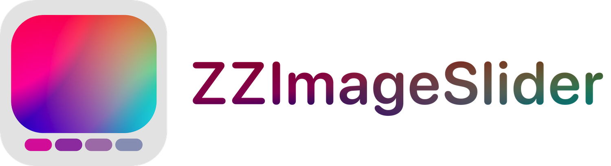
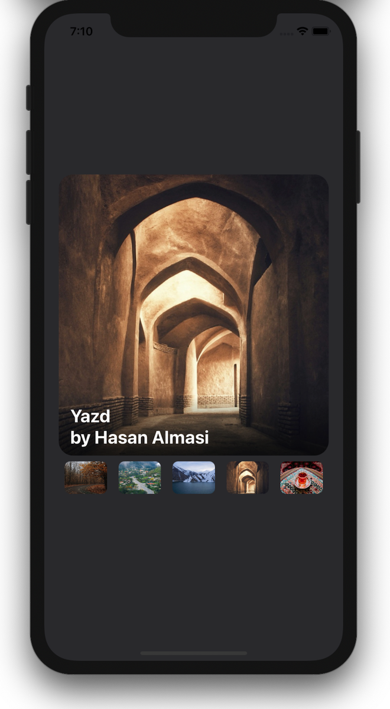
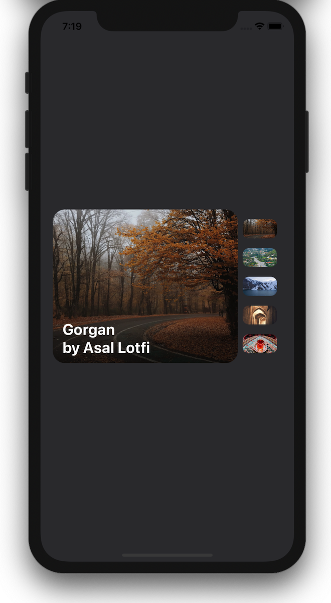

# ZZImageSlider


<br />
<br />
<p align="center">
  
</p>
<br />

`ZZImageSlider` is an easy to use, customizable image slide show written in Swift.

## Features

- [x] Horizontal or vertical mode
- [x] Custom image loading methods
- [x] Configurable properties
- [x] Right-to-left support

## Examples

Horizontal                 |  Vertical
:-------------------------:|:-------------------------:
     |  


## Requirements

- iOS 10.0+
- Xcode 8+

## Usage

```swift
let slider = ZZImageSlider(frame: CGRect(x: 16, y: 100, width: view.bounds.width - 32.0, height: 450))
//or @IBOutlet private weak var slider: ZZImageSlider!

view.addSubview(control)
let items: [ZZSliderItem] =
            [
                UIImageSliderItem(image: UIImage(named: "1.jpg")!, text: "Gorgan\nby Asal Lotfi"),
                BundleSliderItem(imageName: "2.jpg", text: "Astara\nby Moeen Zamani"),
                BundleSliderItem(imageName: "3.jpg", text: "Karaj\nby Majid Hajiloo"),
                BundleSliderItem(imageName: "4.jpg", text: nil),
            ]
```

You can find several ways of adopting to `ZZSliderItem`, such as `UIImageSliderItem` or `BundleSliderItem`. Just adopt your favourite image loader class to `ZZSliderItem`.

### Configurations
| Attribute        | Description      | Default value  |
| ------------- |-------------| -----|
| slideDuration      | Display time of each item    | 5.0 |
| sliderAxis      | slider axis    | horizontal |
| ImageView.contentMode      | content mode of presented image in imageView    | scaleAspectFill |
| ImageView.emptyBackgroundColor      | content mode of background color of imageView    | lightGray |
| ImageView.textBackgroundStyle      | background of slide text label (solid or gradient)    | .gradient(colors: [UIColor.black.withAlphaComponent(0), UIColor.black.withAlphaComponent(0.45)]) |
| ImageView.font | font of slide text label | UIFont.preferredFont(forTextStyle: .body) |
| ImageView.textColor | text color of slide text label | white |
| ImageView.cornerRadius | corner radius of imageView | 20 |
| Items.emptyBackgroundColor | background color of each slide items | lightGray |
| Items.edgeInsets | edge inset of slide items stackView | UIEdgeInsets(top: 8, left: 8, bottom: -8, right: -8) |
| Items.spacing | space between each slide items (stackView.spacing) | 16 |
| Items.cornerRadius | corner radius of each slide items | 8 |
| Items.sizePercent | size percent of items stackView (when slider is horizontal it means height, otherwise width) | 0.2 |
| Items.selectionStyle | style of selected slide item (border or none) | none |

How to configure slider:
```swift
let verticalConfs: ZZSliderConfigs = {
    var confs = ZZSliderConfigs()
    confs.sliderAxis = .vertical
    confs.items.edgeInsets.top = 16
    confs.items.edgeInsets.bottom = -16
    confs.items.cornerRadius = 10
    confs.items.sizePercent = 0.1
    confs.items.selectionStyle = .none
    confs.imageView.font = UIFont.systemFont(ofSize: 25, weight: .bold)
    confs.imageView.textBackgroundStyle = .gradient(colors: [
        UIColor.black.withAlphaComponent(0),
        UIColor.black.withAlphaComponent(0.67)
    ])
    return confs
}()
vSlider.configs = verticalConfs

```
### Delegate
```swift
public protocol ZZImageSliderDelegate: class {
    func didSlideTo(item: ZZSliderItem, index: Int)
    func didSelectSlide(item: ZZSliderItem, index: Int)
}
```
To run the example project, clone the repo, and run `pod install` from the
Example directory first.


## Contribution

Feel free to submit Pull Requests or send me your feedback and suggestions!

## Author

Masoud Sheikh Hosseini

- https://github.com/zzmasoud
- zzmasoud@gmail.com


## License

ZZImageSlider is available under the MIT license. See the LICENSE file
for more info.